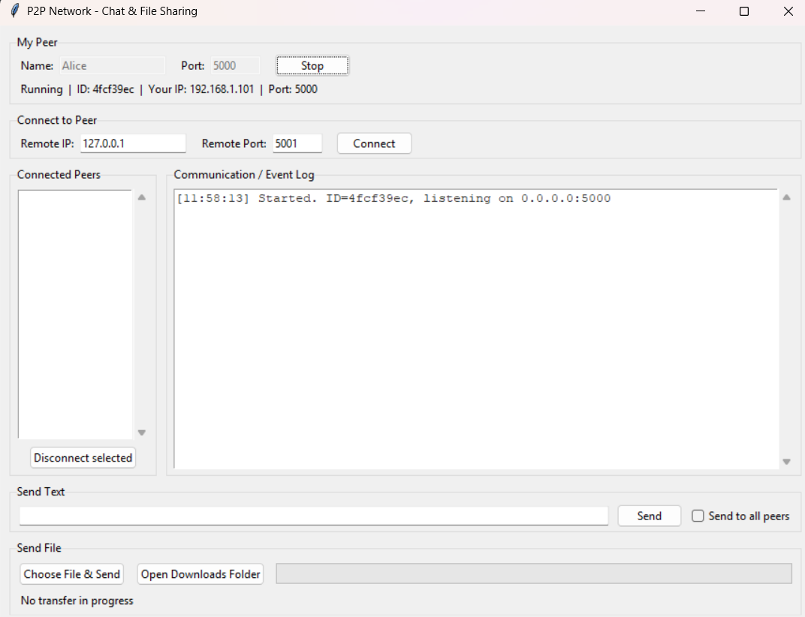
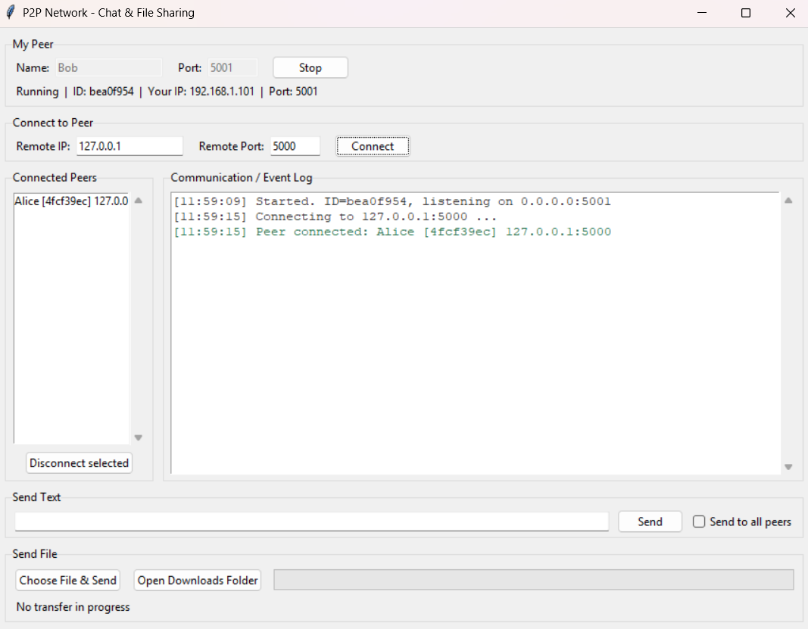
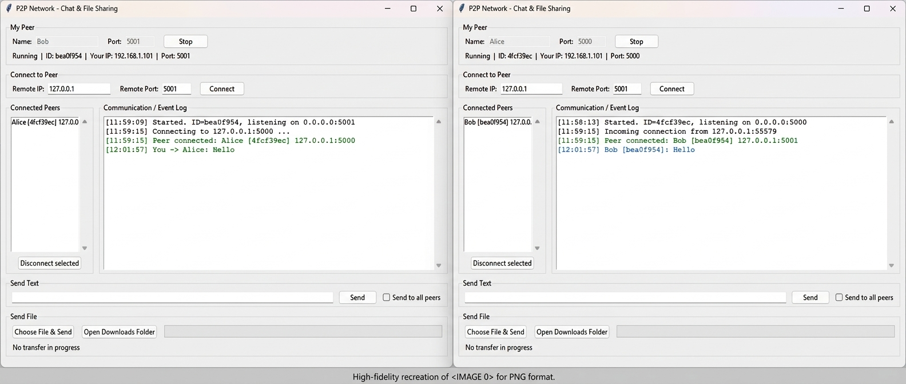
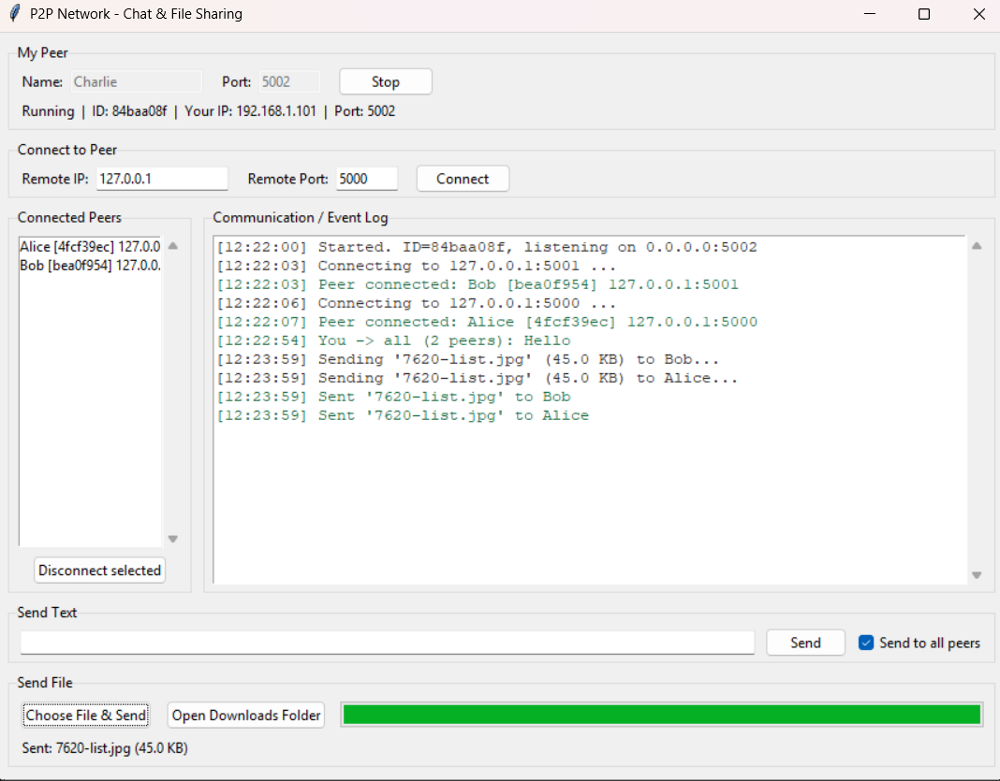

# P2P Network - Communication & File Sharing

## Project Description
A lightweight peer-to-peer (P2P) application written in Python. There is **no central
server**: every running instance is at the same time a **TCP server** (it listens for
incoming connections) and a **TCP client** (it connects to other peers). Peers identify
each other with a JSON `HELLO` handshake, exchange text messages and transfer ordinary
binary files (text, images, audio, video, PDF, ZIP...) directly over TCP, on one computer
or between computers on the same LAN / Wi-Fi. A Tkinter GUI is provided.

## Requirements
- Python 3.9 or later (Windows, Linux or macOS)
- Tkinter (included with the standard Windows/macOS installer; on Ubuntu: `sudo apt install python3-tk`)
- No third-party packages (see `requirements.txt`); only `socket`, `threading`, `json`, `struct`, `os`, `tkinter` and other standard-library modules

## Installation / Setup
1. Download or unzip the project folder.
2. Open a terminal inside the folder (it contains `main.py`).
3. Check Python: `python --version` (3.9+). No `pip install` is needed.

## How to Run
```
python main.py
```
Run it once per peer (each in its own terminal / computer).

1. **My Peer:** enter a *Name* and a *Port* (for example `Alice` / `5000`) and press **Start Peer**.
   The status line shows your peer ID and your LAN IP address.
2. Press **Connect** after entering the other peer's IP and port (see below).
3. Connected peers appear in **Connected Peers**; events and messages appear in the log.
4. Press **Stop** to shut the peer down.

## How to Connect Two Peers
**On the same computer** (different ports are required, because only one socket can listen on a given port):
- Terminal 1: `python main.py` → Name `Alice`, Port `5000`, **Start Peer**
- Terminal 2: `python main.py` → Name `Bob`, Port `5001`, **Start Peer**
- In Bob's window: Remote IP `127.0.0.1`, Remote Port `5000`, press **Connect**

**On two computers (same Wi-Fi / LAN):**
- Start a peer on each computer. Computer A's status line shows its IP (for example `192.168.1.10`).
- On computer B enter Remote IP `192.168.1.10`, Remote Port `5000` and press **Connect**.
- If the connection times out, allow Python through the firewall for *private networks*.

**Three or more peers:** every pair that should talk to each other must be connected
(messages go directly between two peers; there is no relaying). For Alice, Bob and Charlie
connect Bob→Alice, Charlie→Alice and Charlie→Bob.

## How to Send Text
Select a peer in **Connected Peers**, type in the **Send Text** box and press **Send** (or Enter).
If only one peer is connected it is selected automatically. Tick **Send to all peers** to send to everyone.

## How to Transfer Files
Select a peer, press **Choose File & Send** and pick any file. A progress bar shows the
transfer. The receiver saves the file in the `downloads/` folder next to the program
(**Open Downloads Folder** opens it). If a file with the same name exists, the new file is
saved as `name (1).ext`; nothing is overwritten.

## Screenshots
| | |
|---|---|
|  |  |
|  |  |
|  |  |

## Project Structure
| File | Responsibility |
|------|----------------|
| `main.py` | Tkinter GUI and user interaction |
| `p2p_node.py` | Networking: TCP server, client connections, handshake, threads, text and file transfer |
| `protocol.py` | Message framing, JSON encoding/decoding, file chunk helpers |
| `requirements.txt` | Dependency note (standard library only) |
| `downloads/` | Received files are saved here |
| `screenshots/` | Images used by this README |

## GUI Layout
| Section | Purpose |
|---------|---------|
| My Peer | Name, port, Start / Stop |
| Connect to Peer | Remote IP, remote port, Connect |
| Connected Peers | Active peers (name, ID, address); Disconnect button |
| Communication / Event Log | Status events, incoming and outgoing messages, file notices |
| Send Text | Message box, Send, "Send to all peers" |
| Send File | Choose file and send, progress bar, open downloads folder |

## Architecture
```
User Interface (main.py)
        |
   P2P Node (p2p_node.py)   = TCP Server + TCP Client
        |
   Protocol (protocol.py)
        |
   TCP Socket  <-->  Other Peer
```
- **Server role:** a listening socket on `0.0.0.0:<port>`; the accept loop runs in its own thread and starts one handler thread per incoming connection.
- **Client role:** `connect_to_peer(ip, port)` opens an outgoing TCP connection and performs the handshake.
- **Peer registry:** connected peers are stored in a dictionary (`peer_id -> Peer`) protected by a lock.
- Each connected peer has its own receive thread.

## Concurrency Model
| Thread | Purpose |
|--------|---------|
| GUI / main thread | Tkinter event loop; never blocks on network I/O |
| Accept thread | `accept()` loop on the listening socket |
| Handshake thread (per incoming connection) | Runs hello/hello_ack, then becomes the receive thread |
| Receive thread (per peer) | Blocking `recv` loop for one peer; also receives file bytes |
| File sender thread (per transfer) | Sends one file so the GUI never freezes |
| Connect / send worker threads | Blocking connect and text sends triggered from the GUI |

- Shared state (`peers` dict) is protected by a `threading.Lock`.
- Each peer has its own `send_lock`, held for a whole message and for a whole file transfer, so bytes of different messages never interleave.
- If two peers connect to each other at the same time, the connection initiated by the peer with the lower `peer_id` is kept; both sides apply the same rule.
- Closing a connection uses `shutdown()` then `close()` so the blocked receive thread wakes up.
- **Tkinter is not thread-safe.** Network threads never touch widgets: they put events into a `queue.Queue`, and the GUI thread drains it every 100 ms with `root.after()`. Transfer progress is a shared variable that the GUI polls.

## Protocol
Every JSON message is framed as:

```
[4-byte big-endian length][UTF-8 JSON payload]
```
TCP is a byte stream and does not preserve message boundaries, so the receiver reads
exactly 4 bytes, then exactly `length` bytes (`recv_exact`).

Message types: `hello`, `hello_ack`, `text`, `file`.

### Handshake
```
Initiator                              Acceptor
  connect() ---------------------------> accept()
  {"type":"hello","peer_id":"a83f21c4",
   "peer_name":"Alice","port":5000} ---->
  <---- {"type":"hello_ack","peer_id":"92bd71e3",
         "peer_name":"Bob","port":5001}
```
- `peer_id` is a random 8-character ID that identifies a peer.
- `port` is the peer's **listening** port (an outgoing connection uses a random ephemeral port).
- Duplicate connections, self-connections and invalid handshakes are rejected; the handshake has a 5-second timeout.

### Text message
```json
{"type": "text", "sender_id": "a83f21c4", "sender_name": "Alice", "message": "Hello!"}
```
The receiver shows the name registered during the handshake. Empty or over-long (>10,000 characters)
messages are rejected; malformed or unknown messages are ignored with a warning. Text is UTF-8, so Bengali etc. works.

### File transfer
```
Sender                                            Receiver
[4-byte len][{"type":"file","filename":"a.pdf",
              "filesize":1234567, ...}]  ------>  reads metadata
[64 KB][64 KB]...[last chunk]  (exactly 1234567 bytes, not framed)
                                         ------>  reads exactly 1234567 bytes
                                                  saves to downloads/a.pdf
```
- Raw bytes in 64 KB chunks (`64 * 1024`): constant memory for any file size, same protocol for every file type.
- The receiver reads exactly `filesize` bytes and never more, so the next message's header is not consumed.
- The sender holds the peer's `send_lock` for the whole transfer.

## Error Handling
| Situation | Behaviour |
|-----------|-----------|
| Invalid IP / host | `[ERROR] Connection failed: Invalid IP address or host` |
| Invalid port | `Port must be a number` / `between 1 and 65535` |
| Peer not running / refused | `Connection refused (is the peer running?)` |
| No answer | Connect and handshake time out after 5 s |
| Connecting to yourself / twice | `You cannot connect to yourself` / `Already connected to ...` |
| Port already in use | Popup: `Cannot listen on port ...` |
| Peer disconnects (even abruptly) | `Peer disconnected`, removed from the list, app keeps running |
| Silent loss (Wi-Fi off) | TCP keepalive detects the dead connection in ~20-40 s |
| File does not exist / unreadable | `File not found` / `Cannot read file` |
| Invalid `filesize` (negative, > 4 GB) | Sender is disconnected (stream cannot be trusted) |
| Transfer interrupted | Error logged, partial file deleted |
| Disk full while receiving | Rest of the file is discarded to stay in sync, error logged |
| Hostile filename (`..\..\x`) | Directory part removed; saved only inside `downloads/` |
| Send without selecting a peer | Popup asks to select a peer |

## Testing
Command-line self-tests (no GUI needed):
```
python protocol.py
python p2p_node.py selftest      # handshake and connection errors
python p2p_node.py selftest4     # multi-peer, simultaneous connect, disconnects
python p2p_node.py selftest5     # text messaging, concurrency, malformed messages
python p2p_node.py selftest6     # file transfer, SHA-256 verified, hostile senders
python p2p_node.py selftest8     # edge cases, keepalive, stop during transfer
```
Headless peer: `python p2p_node.py node Alice 5000` (commands: `peers`, `send`, `broadcast`,
`sendfile`, `disconnect`, `quit`; type the real peer ID without `<` `>`).

Manual tests performed: two peers on one computer, two computers on one Wi-Fi, three peers
(Alice, Bob, Charlie), text / image / audio / video / PDF / ZIP transfer, and the error cases above.

## Limitations (out of scope for this assignment)
No encryption, no authentication (anyone can claim any name), no peer discovery (the IP and port
must be entered manually), no NAT traversal (peers must be reachable on the same LAN), no relaying
between peers, no transfer resume, no file deduplication.